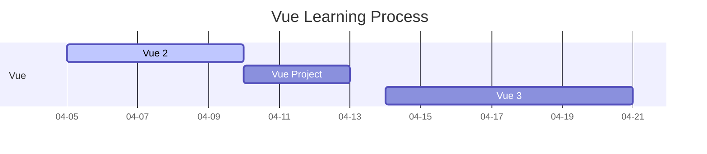
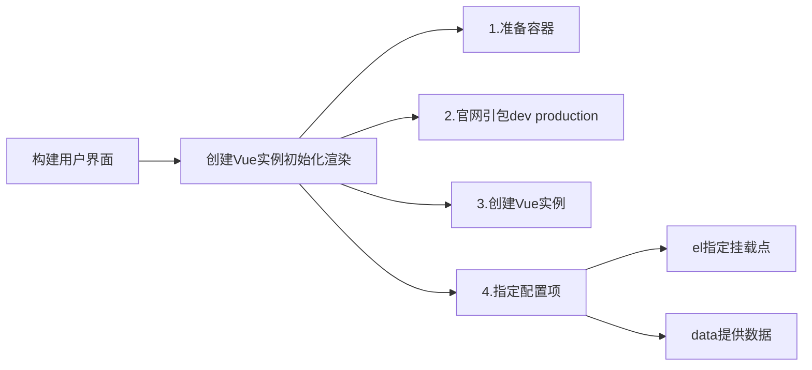
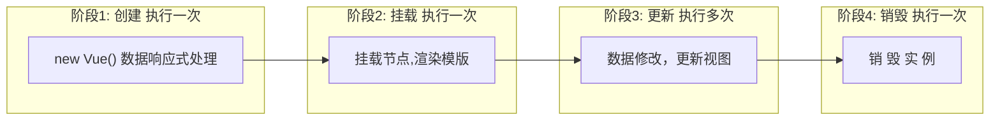
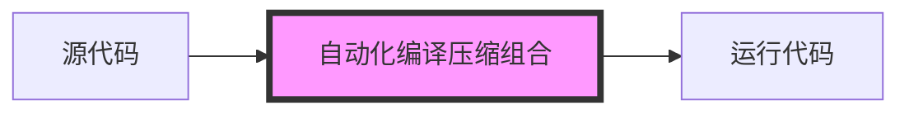
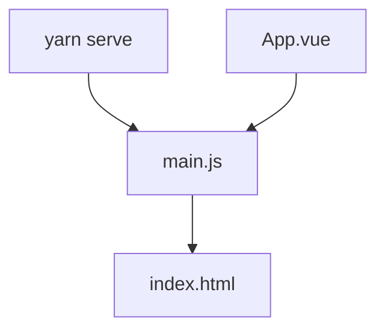
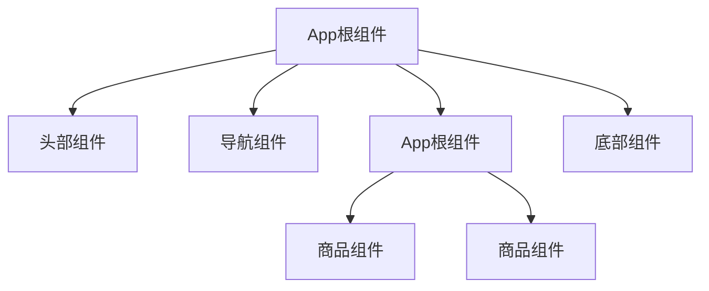
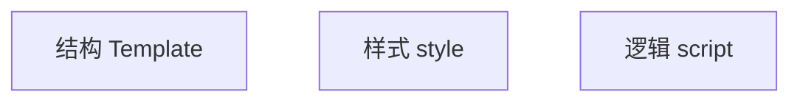
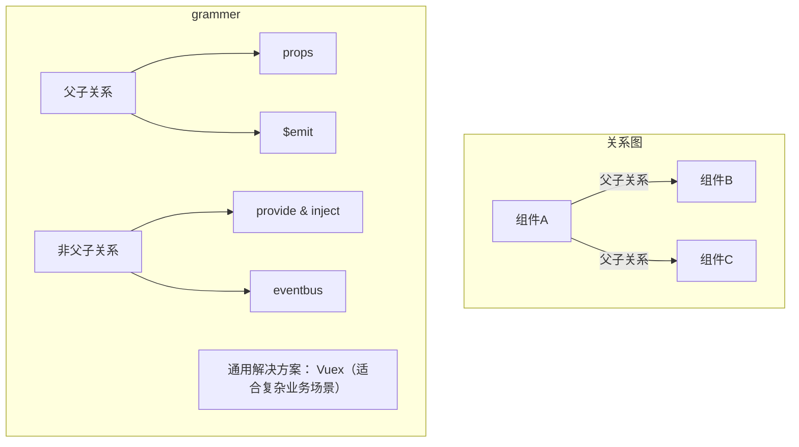
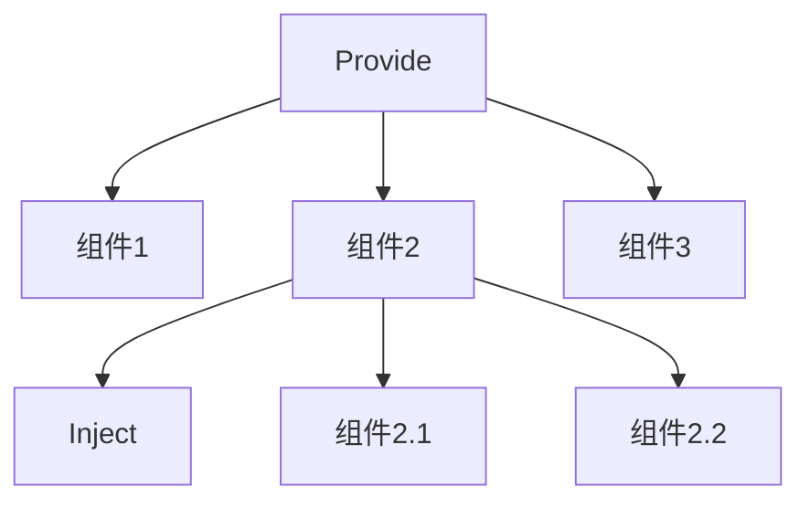

---

title : '学习：Vue2 & Vue3 '
date : 2024-04-05
Lastmod: 
draft : false
author : "Jingyi Wu"
comments: true #是否展示评论
showToc: true # 显示目录
TocOpen: false # 自动展开目录
hidemeta: false # 是否隐藏文章的元信息，如发布日期、作者等

## disableShare: true # 底部不显示分享栏

Showbreadcrumbs: true #顶部显示当前路径
ShowShareButtons: true
ShowReadingTime: true
ShowWordCounts: true
ShowPageViews: true
ShowLastMod: true #显示文章更新时间
hasCJKLanguage: true
summary: Vue2 + Vue3

categories: 

- tech

tags:

- Vue
- VUB
- Frontend

keywords:

- Vue

cover:
​    image: ""
​    caption: "" #图片底部描述
​    alt: ""
​    relative: true

---

> 最近比较沉迷`mermaid`感觉简单干净又好看, 用mermaid展现一下



# Day1&2

## Vue 快速上手

### 1. Vue 概念

是一个用于构建用户界面的渐进式框架

> 1: 构建用户界面 指的是 基于数据渲染出用户看到
>
> 2: 循序渐进： 声明式渲染 - Vue.js 核心包 - 组件系统 - 客户端路由 (VueRouter) - 大规模状态管理(Vuex) - 构建工具(Webpack/Vite)
>
> 3: 框架：一套完整的项目解决方案

Vue 的两种使用方式：

- Vue 核心包开发

  场景：局部模块改造

- Vue 核心包 & Vue 插件 工程化开发

  场景：整站开发

### 2. 创建Vue实例，初始化渲染

构建用户界面 -> 创建Vue实例初始化渲染



代码案例：

```vue
<div id="app">
    {{ msg }}
</div>
<script src="url.js"></script>
<script>
    const app = new Vue({
        // 通过el配置选择器，指定Vue管理的盒子
        el: '#app',
        // 通过data提供数据
        data:{
            msg:'Hello World' // 变量提供数据
        }
    })
</script>
```

3. 总结

创建Vue实例，初始化渲染的核心步骤

1. 准备容器

2. 引包 (官网) -开发版本/生产版本

3. 创建Vue实例 `new Vue()`

4. 指定配置项 `el` `data` 渲染数据

   el 指定挂载点，选择器指定控制盒子

   data 提供数据

### 3.  Vue 插值表达式

> 插值表达式是一种Vue的模版语法 `{{ }}`

1. 作用：利用表达式进行插值，渲染到页面中

   表达式：JS引擎将其返回结果的代码

```javascript
money + 100
money - 100
money * 10
money / 10
price >= 100? 'greater':'ok'
obj.name
arr[0]
fn()
obj.fn()
```

2. 语法 ：` {{ 表达式 }}`

```vue
<h3>{{ title }}</h3>
<p>{{ nickname.toUpperCase() }}</p>
<p>{{ age>=18 ? '成年':'未成年' }}</p>
<p>{{ obj.name }}</p>
```

3. 注意事项

   1. 使用的数据必须在data内声明

   2. 支持表达式，但不支持语句，所以可以写三元表达式，但不能写 `if` `for`

   3. 不能在标签属性中使用 {{ }} 插值

      `<p title = "{{ username }}">这里可以使用插值 </p> `

4. 总结

   1. 插值表达式的作用？

      利用表达式进行插值，将数据渲染到页面中

   2. 语法格式？

      `{{ 表达式 }}`

   3. 插值表达式的注意点

      使用的数据要存在

      支持表达式，而不是语句

      不能在标签属性中使用

### 4. Vue响应式特性

> 数据变化，视图自动更新

`data` 中的数据会被添加到实例上

1. __访问数据:__   实例.属性名 `app.msg`
2. __修改数据:__   实例.属性名 = value `app.msg = '您好 Vue'`

```vue
<div id="app">
    {{ msg }}
</div>
<script src="url.js"></script>
<script>
    const app = new Vue({
        // 通过el配置选择器，指定Vue管理的盒子
        el: '#app',
        // 通过data提供数据
        data:{
            msg:'Hello World' // 变量提供数据
            count:100
        }
    })
</script>
```


### 5. 开发者工具 Devtools

### 6. Vue 指令

> Vue 会根据不同的 【指令】，针对标签实现不同的【功能】

指令： 带有 `v-`的特殊标签属性，大约14个，常用10个，文档可查

#### v-html

示例代码：

```vue
<!--  Vue指令： v- 前缀的标签属性
作用：设置元素的innerHTML
语法：v-html= ‘表达式’
可以解析html标签，如果使用插值表达式的话标签会变成文本
-->
<div v-html = 'str'></div>

<!-- 普通标签属性 -->
<div class = "box">...</div>
<div title = "校长"> ...</div>
```

#### v-show

1. 作用：控制元素显示隐藏
2. 语法：`v-show ='表达式'`，表达式值为`true`显示，`false`隐藏
3. 底层原理：核心是控制元素的`css`属性，控制属性是否显示`style = "display:none"`
4. 场景：频繁切换显示隐藏的场景

#### v-if

1. 作用：控制元素显示隐藏（__条件渲染__）
2. 语法：`v-if ='表达式'`，表达式值为`true`显示，`false`隐藏
3. 底层原理：核心是根据判断条件控制元素的创建和移除。一旦为false，对应标签会消失
4. 场景：要么显示，要么隐藏，不频繁切换的场景

```vue
<body>
  <div id="app">
    <div v-show="flag" class="box">我是v-show控制的盒子</div>
    <div v-if="flag" class="box">我是v-if控制的盒子</div>
  </div>

  <script src="./vue.js"></script>
  <script>
    const app = new Vue({
      el: '#app',
      data: {
        flag: true
      }
    })
  </script>
</body>
```

#### v-else & v-else-if

1. 作用：辅助 `v-if `进行判断渲染
2. 语法：`v-else`    `v-else-if = "表达式"`
3. 注意：需要紧挨着 `v-if`一起使用

```vue
<div id = "app">
    <p v-if="gender === 1"> 性别： 男</p>
    <p v-if="gender === 2"> 性别： 女</p>
    <hr>
     <p v-if= "score >= 90">成绩A</p>
     <p v-else-if= "score >= 70">成绩B</p>
     <p v-else-if= "score >= 60">成绩C</p>
     <p v-else >= 90">成绩D</p>
</div>
```

#### v-on

1. 作用：注册事件 = 添加监听 + 提供处理逻辑

2. 语法：

   `v-on: 事件名 = “内联语句”`

   `v-on: 事件名 = “method中的函数名”`

   `v-on： 事件名 = “method2(参数1，参数2)”` v-on调用传递参数

3. 简写：`@事件名`

```vue
<!-- 内联语句版本 -->
<div id="app">
    <!-- v-on: 可以简写替换为@ -->
    <button v-on:click="count--">-</button>
    <span>{{ count }}</span>
    <button @click="count++">+</button>
  </div>
  <script src="./vue.js"></script>
  <script>
    const app = new Vue({
      el: '#app',
      data: {
        count: 10
      }
    })
  </script>

<!-- method配置项内的函数名 -->
<div id="app">
    <!-- v-on: 可以简写替换为@ -->
    <button @click="fn">切换显示隐藏</button>
    <h1 v-show="isShow">黑马程序员</h1>
  </div>
  <script src="./vue.js"></script>
  <script>
    const app = new Vue({
      el: '#app',
      data: {
        isShow: true
      },
      methods: {
        fn() {
            // this === app, 不能直接使用属性，会报错需要app.属性名 转换至 this.属性名
          this.isShow = !this.isShow
        }
        fn2(a,b){
        console.log(a,b)
    }
      }
    })
  </script>
```

```vue
<!--调用传参数版本 -->
<div id="app">
    <div class="box">
      <h3>小黑自动售货机</h3>
      <button @click="buy(5)">可乐5元</button>
      <!-- <button @click="buyCoffee">咖啡10元</button> -->
      <button @click="buy(10)">咖啡10元</button>
    </div>
    <p>银行卡余额：{{ balance }}元</p>
  </div>

  <script src="./vue.js"></script>
  <script>
    const app = new Vue({
      el: '#app',
      data: {
        cola: 5,
        coffee: 10,
        balance: 1000

      },
      methods: {
        buy(a) {
          this.balance -= +a

        }
      }
    })
  </script>
```

#### v-bind

1. 作用：动态设置 html 的标签属性 —> src url title .....

2. 语法：`v-bind : 属性名=“表达式”`

   __属性名中不能使用插值表达式__ 

3. 简写版 ：src

   `传统版本  `

   `简写版本  `

##### v-bind 对于样式控制的增强

1. 操作 class

   语法： class = "对象"

   1. 对象 -> 键就是类名，值是布尔值。如果值为`true`，有这个类，否则没有这个类

   `<div class = "box" :class = "{类名1: 布尔值， 类名2:布尔值}"></div>`

   2. 数组 -> 数组中所有的类，都会添加到盒子上，本质是class列表

   `<div class="box" :class"[类名1， 类名2， 类名3]"></div>`

```vue
<div id="app">
    <!---使用 :class 对象 绑定 类名-->
    <div class="box" :class="{pink:true,big:true}">黑马程序员</div>
    <!---使用 :class 列表 绑定 类名-->
    <div class="box" :class="['pink','big']">黑马程序员</div>
  </div>
  <script src="https://cdn.jsdelivr.net/npm/vue@2/dist/vue.js"></script>
  <script>
    const app = new Vue({
      el: '#app',
      data: {

      }
    })
  </script>
```

2. 操作 style -> 方便控制单个属性的变化

   语法： `:style = "样式对象"`

   `<div class = "box" :style="{css属性名1:css属性值，css属性名2:css属性值}"></div>`

```vue
<div id="app">
     <!---使用 :style 对象 绑定 样式-->
    <div class="box" :style="{width:'400px',height:'200px',backgroundColor = 'green'}"></div>
  </div>
  <script src="https://cdn.jsdelivr.net/npm/vue@2/dist/vue.js"></script>
  <script>
    const app = new Vue({
      el: '#app',
      data: {

      }
    })
  </script>
```

```vue
<div id="app">
    <div class="progress">
      <div class="inner" :style="{width:percent + '%'}">
        <span>{{percent}}%</span>
      </div>
    </div>
    <button @click="percent = 25">设置25%</button>
    <button @click="percent = 50">设置50%</button>
    <button @click="percent = 75">设置75%</button>
    <button @click="percent = 100">设置100%</button>
  </div>
  <script src="https://cdn.jsdelivr.net/npm/vue@2/dist/vue.js"></script>
  <script>
    const app = new Vue({
      el: '#app',
      data: {
        percent: 0
      }
    })
  </script>
```


#### v-for

1. 作用：基于数据循环，多次渲染整个元素 -> 数组、对象、数字...

2. 遍历数组语法：

   `v-for = "(item,index) in 数组"`

   item 指的是每一项， index 指的是下标

3. `v-for 中的 key`

   key =“唯一标识”

   作用： 给列表项添加的唯一标识。便于Vue进行列表项的正确排序复用

   注意点：

   1. key 的值只能是字符串或数字类型
   2. key的值必须具有唯一性
   3. 推荐使用 id 作为 key (唯一)，不推荐使用 index 作为 key （会变化，不对应）

```vue
<div id="app">
    <h3>小黑水果店</h3>
    <ul>
      <li v-for="(item,index) in list" ：key="item-id">{{item}} - {{index}}</li>
    </ul>

  </div>

  <script src="./vue.js"></script>
  <script>
    const app = new Vue({
      el: '#app',
      data: {
        list: ['西瓜', '苹果', '鸭梨']
      }
    })
  </script>
```

__补充知识：__ `列表.filter()`

- 一个列表方法，具体和`map`/`reduce`差不多,  默认返回新值不改变原数组，所以记得找变量接收

#### v-model

1. 作用：给表单元素使用，双向数据绑定 -> 可以快速获取或设置表单元素内容
   1. 数据变化 -> 视图自动更新
   2. 视图变化 -> 数据自动更新
2. 语法： v-model = '变量'

```vue
<div id="app">
    账户：<input type="text" v-model="username"> <br><br>
    密码：<input type="password" v-model="password"> <br><br>
    <button @click="login">登录</button>
    <button @click="reset">重置</button>
  </div>
  <script src="./vue.js"></script>
  <script>
    const app = new Vue({
      el: '#app',
      data: {
        username: '',
        password: ''
      },
      methods: {
        login() {
          console.log(this.username, this.password)
        },
        reset() {
          this.username = '',
            this.password = ''
        }
      }
    })
  </script>		
```

3. v-model 应用于其他表单元素

   常见的表单元素都可以用 `v-model`绑定关联，快速获取或设置表单元素的值，它会根据控件类型自动选取正确的方法来更新元素

   | 表单类型              | 值      |
   | --------------------- | ------- |
   | 输入框 input:text     | value   |
   | 文本域 textarea       | value   |
   | 复选框 input:checkbox | checked |
   | 单选框 input:radio    | checked |
   | 下拉菜单 select       | value   |

### 7. 指令修饰符

> 通过 “ . ” 指明一些指令 后缀，不同后缀封装了不同的处理操作 —> 简化操作

1. 按键修饰符

   `@keyup.enter ` —> 键盘回车监听

2. v-model 修饰符

   `v-model.trim` —> 去除首尾空格

   `v-model.number ` –> 转数字

3. 事件修饰符

   `@事件名.stop` —> 阻止冒泡

   `@事件名.prevent` —> 阻止默认行为

### 8. 计算属性

> 基于现有的数据，计算出新的属性。依赖的数据变化，自动重新计算

**语法**：

1. 声明在 computed 配置项中，一个计算属性对应一个函数。computed 与 data 同级
2. 使用起来和普通属性一样使用 `{{ 计算属性名 }}`
3. 计算属性 -> 就是将求值还输封装

**注意**：使用计算属性时不用加小括号，会导致报错

```:radio:
computed :{
    计算属性名(){
        基于现有数据，编写求值逻辑
        return 结果
    }
}
```

**缓存特性(提升性能)**

1. 计算属性会对计算出来的结果缓存，再次使用直接读取缓存，依赖项变化了，会自动重新计算 -> 并再次缓存

与 methods方法对比：

1. 作用：methods给实例提供一个方法，调用以处理业务逻辑

2. 语法：写在methods配置项中

   作为方法，需要调用 -> `this.方法名() {{ 方法名() }} @事件名=“方法名”`

计算属性的修改：

1. 计算属性默认的简写，只能读取访问，不能修改。如果要修改需要写计算属性的完整写法

```vue
<!--简写版本-->
computed: {
    计算属性名(){
		一段代码逻辑(计算逻辑)
		return 结果
    }
}
<!--完整版本-->
computed: {
  计算属性名{
<!--get-->
	get(){
		一段代码逻辑(计算逻辑)
		return 结果
    	},
<!--set-->
	set(修改的值){
		一段代码逻辑 (修改逻辑)
		}
	}
}
```

### 9. watch 侦听器（监听器）

#### 简写：

1. 作用： 监视数据变化，执行一些业务逻辑或异步操作
2. 语法：
   1. 简单写法： 简单类型数据，直接监视
   2. 完整写法： 添加额外配置项

```vue
data: {
    words:'苹果',
	obj:{
		word: '苹果'
	}
}，
watch: {
	<!-- 该方法会在数据变化时触发执行 
	newValue 新值 oldValue老值 (一般不用)，
	所以有时只写newValue一个参数
	-->
	数据属性名 (newValue, oldValue){
		一些逻辑 // 异步操作
	},
	<!-- 对象里面的子属性记得加 引号
	-->
	'对象.属性名'(newValue,oldValue){
		一些逻辑 // 异步操作
	}
}
```

#### 完整写法：添加额外配置项

1. `deep: true` 对复杂类型深度监视，任何对象的修改都可以监视到，`handle`是执行的方法
2. `immediate: true` 初始化立刻执行一次 `handler` 方法。

```vue
<script>
watch: {
        fruitList: {
          deep: true,
          immediate: true,
          <!--将变化后的newValue存入本地-->
          handler(newValue) {
            console.log(newValue)
            localStorage.setItem('list', JSON.stringify(newValue))
          }
        }
      }
</script>
```

#### watch侦听器的语法有两种

1. 简单写法： 监视简单类型的变化
2. 完整写法：添加额外的配置项（深度监视复杂类型，立刻执行）

#### 案例技术总结：

1. 渲染功能： `v-if/v-else`   `v-for`遍历  `:class`绑定样式
2. 删除功能：点击传参 `filter 过滤覆盖原数组`
3. 修改个数：点击传参 `find`
4. 全选反选：计算属性`computed` 完整写法 `get/set`
5. 统计选中的总价和总数量：计算属性`computed reduce`条件求和
6. 持久化到本地：`watch`监视，`localStorage` ,`JSON.stringify`, `JSON.parse`

# Day3

## 生命周期

### 1. Vue 生命周期介绍

Vue生命周期： 一个Vue实例从创建到销毁的整个过程

> 思考：什么时候发送初始化渲染请求？（越早越好）什么时候开始操作dom？ （至少dom渲染出来）



### 2. Vue生命周期函数(钩子函数)

Vue生命周期过程中，会自动运行一些函数，称为生命周期钩子，让开发者可以在特定阶段运行自己的代码。<i>四个周期八个函数</i>

+ Vue提供 `vue实例.$destroy()`方法卸载实例，通常在卸载阶段做性能优化，清楚一些小组件
+ 大多数使用 `created` 和`mounted` 比较多


### 3. created 应用

> `created` ： 在此阶段发送请求。因为响应式数据已经准备好了，可以发送初始化渲染请求。`beforeCreated`阶段还都没准备好

```vue
<script>
const app = new Vue({
	el: #app,
	data: {
		list:[]
	},
<！-- 发送请求 -->
    async created(){
		const res = await axios.get('url')
		console.log(res)
    }
})
</script>
```

### 4. mounted 应用

> `mounted`: 模版渲染完成，开始操作`DOM`

```vue
<script>
    const app = new Vue({
        el: '#app',
        data:{
            words:''
        },
        // 核心思路
        // 1. 等输入框渲染出来
        // 2. 让输入框获取焦点
        mounted (){
            // 给输入框焦点
            document.querySelector('#inp').focus
        }
    })
</script>
```


## 工程化开发 & 脚手架 Vue CLI

### 1. 引入

开发Vue的两种方式：

1. 核心包传统开发模式： 基于html/css/js 文件，直接引入核心包，开发Vue。
2. 工程获开发模式：基于构建工具（例如：webpack）的环境开发Vue

__问题:__  CLI 脚手架解决的问题，生成标准化配置

1. webpack配置不简单
2. 雷同的基础配置
3. 缺乏统一标准



### 2. 介绍脚手架Vue CLI 

> Vue CLI 是Vue官方提供的基于node的一个全局命令工具

通过Vue CLI 可以帮助我们快速创建一个开发Vue项目的标准化基础架子。集成了webpack

__优点:__

1. 开箱即用，零配置
2. 内置 babel等工具
3. 标准化

__使用步骤：__

1. 全局安装 (一次) `yarn global add@vue/cli` 或 `npm i @vue/cli -g`
2. 查看Vue版本 `vue --version`
3. 创建项目架子（项目名称不能使用中文）`vue create project-name`
4. 启动项目：`yarn serve ` 或 `npm run serve` (可以在 `package.json`的`script`中配置的)

### 3.脚手架目录文件介绍 & 项目运行流程




#### 1. `public/index.html` 讲解

```html
<body>
    <noscript>
        <!--给不支持js浏览器使用的-->
      <strong>We're sorry but <%= htmlWebpackPlugin.options.title %> doesn't work properly without JavaScript enabled. Please enable it to continue.</strong>
    </noscript>
        <!--Vue 所管理的容器，将来创建结构动态渲染-->
    <div id="app"></div>
         <!--工程化开发模式中：这里不再编写代码，在App.vue编写-->
    <!-- built files will be auto injected -->
  </body>
```

#### 2.`main.js` 讲解

```javascript
// 文件核心作用：导入App.vue，基于App.vue创建构造渲染 index.html
// 1. 导入 Vue 核心包
import Vue from 'vue'
// 2. 导入 App.vue 根组件
import App from './App.vue'

// 提示：当前处于什么环境 （生产化境/开发环境）
Vue.config.productionTip = false

// 3. Vue实例化，提供render方法 -> 基于App.vue创建结构渲染 index.html. 此版本为简写版，写一个原始版本看看那
new Vue({
  render: h => h(App),
}).$mount('#app')

new Vue({
    el:'#app', 
    // 作用：和$mount('#app')作用一致，用于指定Vue所管理容器
    // render: h=>h(App),
    render:(createElement)=>{
        // 基于App创建元素结构
        return createElement(App)
    }
})

```

**本质上： 基于App.vue创建结构，最终渲染index.html中 id=app的盒子**

#### 3. `App.vue `组件化开发&根组件

##### 1. 组件化开发&根组件

1. 组件化：一个页面可以拆分成一个个组件，每个组件都有自己的独立结构、样式、行为

   __好处：__ 便于维护，利于复用 --> 提升开发效率

2. 组件分类：普通组件、根组件

3. 根组件：整个应用最上层的组件，包裹所有普通的小组件




##### 2.App.vue

三部分组成：

- template: 结构（有且只有一个根元素 Vue2）
- script：js逻辑
- style：样式（可支持less，需要装包）

让组件支持 less

- `style`标签，`lang="less"`开启less功能
- 装包：`npm add less less-loader`

```vue
<!--结构组件-->
<template>
  <div id="app">
    
    
    <HelloWorld msg="Welcome to Your Vue.js App" />
  </div>
</template>

<!--行为组件-->
<!-- export导出当前组件JS配置项, 里面可以提供data/methods/computed/watch-->
<script>
    
import HelloWorld from './components/HelloWorld.vue'

export default {
  name: 'App',
  components: {
    HelloWorld
  }
}
</script>

<!--样式组件-->
<style>
#app {
  font-family: Avenir, Helvetica, Arial, sans-serif;
  -webkit-font-smoothing: antialiased;
  -moz-osx-font-smoothing: grayscale;
  text-align: center;
  color: #2c3e50;
  margin-top: 60px;
}
</style>
```

__总结:__

1. 组件化：

   页面可拆分成一个个组件，每个组件有独立的结构、样式、行为

   好处：便于维护，利于复用 -> 提升开发效率

   组件分类：普通组件、根组件

2. 根组件：

   整个应用最上层的组件，包裹所有普通小组件

   一个根组件App.vue 包含三个部分

   1. template 结构
   2. style 样式
   3. script行为

#### 4. 普通组件的注册使用

组件注册的两种方式：

1. 局部注册：只能在注册的组件内使用

   1. 创建 `.vue`文件（三个组成部分）
   2. 在使用的组件内导入并注册 （一次可以注册多个组件）

2. 全局注册：所有组件内都能使用

   与局部注册不同的是，局部注册在哪里注册在哪里使用。全局注册一旦注册成功，全局使用

   1. 创建 `.vue`文件（三个组成部分）
   2. 在`main.js`中进行全局注册 （一次只能注册一个组件）

使用（全局/局部使用方法相同）：

- 当成 html 标签使用 `<组件名></组件名>`

注意（全局/局部注意事项相同）：

- 组件名规范-> 大驼峰命名法，HmHeader


```vue
<!--局部注册 导入需要注册的组件 -->
import 组件对象 from 路径
export default {
	// 局部组册
	components:{
	'组件名'：组件对象,
	}
}
```

```vue
<!--全局注册 导入需要注册的组件 -->
import 组件对象 from 路径
<!--调用 Vue.component 进行全局注册 -->
<!--Vue.component('组件名',‘组件对象’)  -->
Vue.component('HmButton',HmButton)
```

# Day4

## 1. 组件的三大组成部分



1. 结构 templates 只能有一个根元素

2. 样式 style 全局样式（默认），作用域全局影响所有组件。局部样式`scoped`只作用于当前组件

   `<style scoped>`

   `scoped` 的原理： 给当前组件模版的所有元素，都会被添加一个自定义属性`data-v-hash` ,利用hash值判定是否在组件范围内

3. <strong>el 是根实例独有</strong>， data是一个函数，其他配置项一致

   一个组件的data选项必须是一个函数 -> 保证每个组件实例，维护独立的一份数据对象。每次创建新的组件实例，都会执行一次data函数，得到新的对象

   > 感觉老师的课件有点不说人话了，大致意思是，每一个data都会产生一个新的对象，这样在使用的时候（如修改数据）就不会影响到其他的模块

   

## 2. 组件通信

组件通信，就是指组件与组件之间的数据传递

- 组件的数据是独立的，无法直接访问其他的组件数据
- 想用其他组件数据 -> 组件通信 

### 2.1组件关系分类

1. 父子关系

   父传子的步骤：[使用 props]

   1. 父组件内 给子组件标签添加属性方式，传值
   2. 子组件中通过props进行接收
   3. 子组件中渲染使用属性

   ```vue
   <!-- 父组件的vue文件中 -->
   
   <template>
   	<div>
       	我是父组件
           <!-- 1. 给组件标签，添加属性的方式，传值 -->
       	<Son :title="myTitle"></Son>
           <!--:title 动态属性，这样就可以将data中的myTitle传递给title属性了-->
   	</div>
   </template>
   <script>
       import Son from './component/Son.vue'
       export default {
           data(){
               return {
                   myTitle:'黑马程序员'
               }
           },
           components:{
               Son
           }
       }
   </script>
   ```

   ```vue
   <!-- Son组件的vue文件中 -->
   <template>
   	<div style="border:3px">
           <!-- 3. 渲染使用 title 属性 -->
           我是Son组件 {{ mytitle }}
       </div>
   </template>
   <script>
       export default{
           //  2. 通过 props进行接收
           props: ['title']
       }
   </script>
   ```

   子传父的步骤：[使用 emit]

   1. 子组件`methods`内，`$emit`触发事件，给父组件发送消息通知
   2. 父组件内 监听事件
   3. 父组件提供处理函数，形参中获取参数

   ```vue
   <!--父组件-->
   <template>
     <div class="app" style="border: 3px solid #000; margin: 10px">
       我是APP组件
       <!--2. 父组件，对消息进行监听 @是v-on的缩写不要忘记了-->
       <Son :mytitle="myTitle" @changeTitle = "handleChange"></Son>
     </div>
   </template>
   <script>
   import Son from './components/Son.vue'
   export default {
       name:'APP',
       data(){
           return {
               myTitle:'今天发布了期末考试安排'
           }
       },
       methods:{
           handleChange(newTitle){
               this.myTitle = newTitle
           }
       },
       components:{
           Son
       },   
   }
   </script>
   ```

   ```vue
   <!--子组件-->
   <template>
     <div class="son" style="border:3px solid #000;margin:10px">
       我是Son组件 {{mytitle}}
       <button @click = "changeFn">修改title</button>
     </div>
   </template>
   <script>
       export default{
           name: 'Son',
           props:['mytitle'],
           methods:{
               changeFn(){
                   // 1. 通过$emit，向父组件发送消息
                   this.$emit('changeTitle','改名公式')
               }
           }
       }
   </script>
   <style>
   </style>
   ```

2. 非父子关系



### 2.2 props

#### <strong>1. 详解什么是 Prop? </strong>

1. 定义： 组件上注册的一些自定义属性
2. 作用：向子组件传递数据
3. 特点：可以传递任意数量/类型的 prop，用列表来展示


#### 2. props 校验

> 避免组件中的prop乱传的现象，为组件的prop指定验证要求，不符合眼球，控制台就会报错，帮助开发者重新快速发现错误

语法：

1. 类型校验

   ```vue
   props:{
   	校验的属性名：类型 <!-- Number String Boolean -->
   }
   ```

2. 非空校验

3. 默认值

4. 自定义校验

   ```vue
   props: {
   	校验的属性名：{type:Number}, 
   	<!-- Number String Boolean -->
   	required: true,<!--true表示必填-->
   	default: 默认值, <!--给一个默认值, 如果数据缺失可以按照默认值来-->
   	<!--非空和默认值是互斥的-->
   	validator(value){
   		<!--自定义校验逻辑,value就是在父组件中传递过来的值-->	
   	}
   }
   ```

#### 3. Prop & data的区别及单项数据流知识点

- 共同点： 都可以给组件提供数据

- 区别：谁的数据谁负责原则

  data 的数据是自己的 -> 随便改。例如数据框中可以++ --

  prop的数据是外部的 -> 不能直接改，要遵循单向数据流原则

*单向数据流原则：父组件的prop有变化，会自动向下流动，影响子组件


#### 2.3 非父子通信（拓展）- event bus 事件总线

作用：非父子组件之间，进行简易消息传递（复杂场景-> Vuex）

1. 因为两个组件是非父子关系，所以我们要创建一个两个或多个组件都能访问到的事件总线（空Vue实例）-》`utils/EventBus.js`

   本质是利用vue的事件机制来进行消息传递

   ```vue
   import Vue from 'vue'
   const Bus = new Vue()
   export defalut Bus
   ```

2. A组件（接收方），监听Bus实例的事件

   ```vue
   created(){
   <!-- $on 是表示事件监听的意思-->
   	Bus.$on('sending',(msg)=> {
   		this.msg = msg
   	})
   }
   ```

3. B组件（发送方），触发Bus实例的事件

   ```vue
   Vus.&emit('sendMsg', '这是一个消息')
   ```

```mermaid
graph TD
	组件A -.1.监听.-> Bus 
	组件B --"2.发送通知，触发Bus"--> Bus
	Bus--"3.Bus被触发，组件A在监听同时也被触发"--> 组件A
	组件C -.1.监听.-> Bus 
	Bus--"3.Bus被触发，组件A在监听同时也被触发"--> 组件C
	
```

- 完整的代码写法：

```vue
<!-- /utils/EventBus.js -->
<!-- 总线  Bus-->
import Vue from 'vue'
const Bus = new Vue()
export default Bus
```

```vue
<!-- Base A.vue 事件的接收方 -->
<template>
  <div class="base-a">
    我是A组件（接受方）
    <p>{{msg}}</p>  
  </div>
</template>
<script>
    import Bus from '../utils/EventBus.js'
    export default{
        data(){
            return{
                msg: '',
            }
        },
        created(){
            Bus.$on('sendMsg',(msg)=>{
                this.msg = msg
            })
        }
    }
</script>
<style></style>
```

```vue
<!-- Base B.vue 事件的发送方 -->
<template>
  <div class="base-b">
    <div>我是B组件（发布方）</div>
    <button @click="sendMsgFn">发送消息</button>
  </div>
</template>
<script>
    import Bus from '../utils/EventBus'
    export default{
        methods: {
            sendMsgFn(){
                // 注意 这部分的方法名 要与 Base A 接收的方法名一致
                Bus.$emit('sendMsg','今天天气好好呀!!')
            },
        }.
    }
</script>
<style></style>
```

#### 2.4 非父子通信（扩展） - provide & inject

​	project & inject 作用： 跨层级共享数据

- 在顶层`provide`，可以在第三层`inject`



1. 父组件 `provide` 提供数据

```vue
<script>
    export default {
        provide(){
            return {
                // 普通类型 【非响应式】
                // 意味着 父组件 修改普通类型 不会影响 子孙组件的数据
                color: this.color
                // 复杂类型 【响应式】
                // 意味着父组件 修改普通类型，会影响 子孙组件的数据
                userInfo : this.userInfo
            }
        },
        data(){
            return {
                color: 'pink',
                userInfo: {
                    name: '啦啦啦',
                    age: 18
                }
            }
        }
    }
</script>
```

2. 子组件/ 孙组件 `inject`提供数据

```vue
<template>
	<div class = "grandSon">
        我是GrandSon组件
        {{ color }} {{ userInfo.name }}
    </div>
</template>
<script>
    export default {
        // 接收 provide中提供的数据
        inject: ['color', 'userInfo']
    }
</script>
```

### 2.3 v-model 原理

1. 原理

   v-model 本质上是语法糖。利于应用在输入框上，代表`value`属性和`input`事件的合写。本笔记只针对于输入框进行解释，`v-model`会自动判断是复选框还是输入框。

2. 作用： 提供数据的双向绑定

   1. 数据变，视图跟着变 `:value`
   2. 视图变， 数据跟着变 `@input`

   注意： `$event` 用于在模版中，获取事件的形参

```vue
<template>
	<div id = "app">
        <!-- 使用 v-model -->
        <input v-model = "msg" type="text"></input>
		<!-- 使用 原始版本 -->
		<!--监听input,一旦对话框内发生变化，将事件的值传给data中的msg, :value是绑定msg &event值得是拿到改事件的形参-->
		<input :value = "msg" @input= "msg = $event.target.value" type="text">
    </div>
</template>
```

#### 2.3.1表单类组件封装 & v-model 简化代码

1. 表单类组件 封装 -> 实现子组件和父组件
   1. 父传子： 数据应该是父组件 `props` 传递过来， v-model 拆解 绑定数据
   2. 子传父： 监听输入，子传父传值给父组件修改


```vue
<!-- 父组件 App.vue-->
<template>
	<div class = "app">
        <BaseSelect :cityId = "selectId" @changeId="selecteId = $event"></BaseSelect>
        // 使用 $event 可以拿到 对应方法的形参值
    </div>
</template>
<script>
    import BaseSelect from './components/BaseSelect.vue'
    export default {
        data(){
            return {selectId :'102'}
        },
        components: {BaseSelect}
    }
</script>
<style></style>
```

```vue
<!--子组件-->
<template>
	<div>
        // @change 监听改变事件
        <select :value = "cityId" @change = "handleChange">
            <option value='101'>北京</option>
            <option value='102'>上海</option>
    	</select>
    </div>
</template>
<script>
    export default {
        props: {
            cityId: String
        },
        methods:{
            handleChange(e){
                this.$emit('changeId',e.target.value)
            }
        }
    }
</script>
```

2. 父组件 `v-model`简化代码，实现子组件和父组件数据 双向绑定

   - 为什么在父组件添加 `v-model`， 因为子组件无法修改父组件传递上来的数据

   1. 子组件： `props` 通过`value` 接收，事件触发 `input`
   2. 父组件： `v-model` 给组件直接绑定数据 `:value+@input`

```vue
<!-- 父组件 App.vue-->
<!-- v-model => value +@input-->
<!-- 因为 v-model本质是value和input所以在使用时，我们要进行配置-->
<template>
	<div class = "app">
        <BaseSelect v-model="selectId"></BaseSelect>
        // 使用 $event 可以拿到 对应方法的形参值
    </div>
</template>
<script>
    import BaseSelect from './components/BaseSelect.vue'
    export default {
        data(){
            return {selectId :'102'}
        },
        components: {BaseSelect}
    }
</script>
<style></style>
```

```vue
<!--子组件-->
<template>
	<div>
        // @change 监听改变事件
        <select :value = "value" @change = "handleChange">
            <option value='101'>北京</option>
            <option value='102'>上海</option>
    	</select>
    </div>
</template>
<script>
    export default {
        props: {
            value: String
        },
        methods:{
            handleChange(e){
                this.$emit('input',e.target.value)
            }
        }
    }
</script>
<style></style>
```

1. 关于表单类基础组件封装思路

   1. 父传子： 父组件动态传递`prop`数据，拆解`v-model`，绑定数据

   2. 子传父： 监听输入，子传父传值给父组件修改

      本质：实现子组件和父组件数据的双向绑定

2. `v-model `简化代码的核心步骤

   1. 子组件：props 通过`value`接收，事件触发`input`
   2. 父组件： `v-model` 给组件直接绑定数据

#### 2.3.2 关于.sync修饰符

1. 作用： 实现 子组件 与 父组件数据的双向绑定，简化代码
2. 特点： `prop`属性名，可以自定义，非固定为`value`
3. 场景：封装弹框类的基础组件，`visible`属性`true`显示` false`隐藏
4. 本质： `:属性名`和`@update:属性名`合并

```vue
<!-- 父组件 -->
<!-- 简化版本 -->
<BaseDialog :visible.sync = "isShow"/>
<!-- 完整版本 -->
<BaseDialog :visible = "isShow"
            @update: visible="isShow = $event"/>
```

```vue
<!-- 子组件 -->
props: {
	<!-- 接收的值 -->
	visible: Boolean
},
<!-- 这边要写上更新的属性 -->
this.$emit('update:visible', false)
```

### 2.4 ref 和 $refs

1. 作用：利用 `ref` 和 `$refs` 可以用于 获取 `dom`元素或组件实例

2. 特点：查找范围 -> 当前组件内 （更精确稳定）

3. 步骤：

   <strong>获取dom</strong>

   1. 目标标签 - 添加 `ref` 属性

   ```vue
   <div ref = "chartRef"> 我是渲染图表的容器</div>
   ```

   2.  恰当时间 (至少等`dom`元素渲染出来)，通过`this.$refs.xxx`,获取目标标签

   ```vue
   mounted(){
   	console.log(this.$refs.chartRef)
   },
   ```

   <strong>获取组件</strong>

   1. 目标组件 - 添加 `ref` 属性

   ```html
   <BaseForm ref = "baseForm"></BaseForm>
   ```

   1. 恰当时机，通过 `this.$refs.xxx`，获取目标组件，就可以调用组件对象里面的方法

   ```html
   this.$refs.baseForm.组件方法()
   ```

### 2.5 Vue异步更新 与  $nextTick

Vue 是异步更新DOM, 所以`$nextTick` 等DOM更新后，才会触发执行此方法里面的函数体。`this.$nextTick(函数体)`

```vue
this.$nextTick(()=>{
	this.$refs.inp.focus()
})
```


